# Vercel Azure DevOps Extension

This extension contains Azure Pipelines tasks for automatically deploying your Azure DevOps project to Vercel.

- [Vercel Azure DevOps Extension](#vercel-azure-devops-extension)
  - [Extension Set Up](#extension-set-up)
  - [Basic Pipeline Set Up](#basic-pipeline-set-up)
  - [Full Featured Pipeline Set Up](#full-featured-pipeline-set-up)
  - [Extension Reference](#extension-reference)
    - [Task: `vercel-deployment-task`](#task-vercel-deployment-task)
    - [Task: `vercel-azdo-pr-comment-task`](#task-vercel-azdo-pr-comment-task)
  - [Azure PAT Set Up](#azure-pat-set-up)
  - [Azure Build Policy Set Up](#azure-build-policy-set-up)

## Extension Set Up

1. Create a Vercel Project
1. Create a Vercel Personal Access Token with permissions to deploy the project created on step 1 (see the [Vercel PAT Set Up](https://vercel.com/guides/how-do-i-use-a-vercel-api-access-token) guide for more information)
1. If you're planning on using the Pull Request Commenting Task, create an Azure DevOps Personal Access Token with permissions to Read/Write Pull Request threads (see the [Azure PAT set up](#azure-pat-set-up) guide for more information)
1. Store the tokens as secret variables in your preferred methodology. Azure recommends using the [UI, Variables Groups, or Azure Key Vault](https://learn.microsoft.com/en-us/azure/devops/pipelines/process/set-secret-variables). Whichever methodology you use, make sure it is accessible from Azure Pipelines.
1. Navigate to the [Vercel Deployment Extension](https://marketplace.visualstudio.com/items?itemName=Vercel.vercel-deployment-extension) Visual Studio Marketplace page and add the extension to your organization.
   > Note: This step will not work until the extension is shared with the user or we make the extension public.
1. With the extension added, you are now ready to use the tasks in your Azure Pipeline. The tasks are referable using `vercel-deployment-task` and `vercel-azdo-pr-comment-task`.
   > Note: Within a pipeline definition, the tasks will be used like `- task: vercel-deployment-task@3`. The `@3` represents the Major version of the task that the pipeline should use. Make sure to indicate the latest major version of the task when creating your pipeline.

Explore the following pipeline guides for further set up instructions:

- [Basic Pipeline Set Up](#basic-pipeline-set-up)
- [Full Featured Pipeline Set Up](#full-featured-pipeline-set-up)

## Basic Pipeline Set Up

This short guide will demonstrate how the extension can be used to automatically deploy the `main` branch to production. Make sure the steps in [Extension Set Up](#extension-set-up) have been completed.

1. Start by creating a new pipeline file in your repo called `basic-pipeline.yml`. Either use the in-browser editor, or in your local file editor.
1. Add a `trigger:`, `pool:`, and `steps:` declarations:

   ```yaml
   trigger:
     - main

   pool:
     vmImage: ubuntu-latest

   steps:
   # - task: ...
   ```

   > The `trigger:` declaration states that this pipeline should run for all commits to the `main` branch.

1. Now add the extension's task `vercel-deployment-task`:
   ```yaml
   steps:
     - task: vercel-deployment-task@3
       name: Deploy
       inputs:
         vercelProjectId: "<project-id>"
         vercelTeamId: "<team-id>"
         vercelToken: "<vercel-token>" # '$(VERCEL_TOKEN)'
         production: true
   ```
   - The `vercelToken` should reference the secret variable defined in [Extension Set Up](#extension-set-up).
1. Commit, and push the pipeline to the repository.
1. Navigate to Azure Pipelines and run the task for the first time if it doesn't run automatically.
1. Make a change to your project and commit to the `main` branch, a new deployment pipeline run should automatically kick off in Azure Pipelines, and the Vercel Project should automatically update.

## Full Featured Pipeline Set Up

This guide will demonstrate how to improve the [Basic Pipeline Set Up](#basic-pipeline-set-up) pipeline in order to deploy from `main` to production _and_ deploy from pull requests to preview.

1. Starting with the pipeline file created in [Basic Pipeline Set Up](#basic-pipeline-set-up), duplicate, rename, or open it in your editor of choice.
1. Add a variable above the `steps` block
   ```yaml
   variables:
     isMain: $[eq(variables['Build.SourceBranch'], 'refs/heads/main')]
   ```
1. Update the `production: true` input to be `production: $(isMain)`
1. Below `inputs:`, add a `condition`:
   ```yaml
   inputs:
     # ...
   condition: or(eq(variables.isMain, true), eq(variables['Build.Reason'], 'PullRequest'))
   ```
1. Then add a new task step immediately after the `vercel-deployment-task` step, adding the PR commenting feature:
   ```yaml
   - task: vercel-azdo-pr-comment-task@3
     inputs:
       azureToken: $(AZURE_PAT)
       deploymentTaskMessage: $(Deploy.deploymentTaskMessage)
   ```
   - The `vercel-deployment-task` sets an output variable called `deploymentTaskMessage`. The reference `$(Deploy.deploymentTaskMessage)` comes from the `name: Deploy` on the `vercel-deployment-task` step.
1. Push these changes to the repository, and set a [Build Policy](#azure-build-policy-set-up) for the `main` branch.
1. Now create a new branch, push a commit, and open a PR against `main`. A new pipeline execution should trigger and it should create a preview deployment on Vercel as well as comment back on the PR with the preview URL.

## Extension Reference

### Task: `vercel-deployment-task`

An Azure Pipelines Task Extension for automatically deploying to Vercel.

The configuration inputs `vercelProjectID`, `vercelTeamId`, and `vercelToken` can all be replaced with environment variables. See their respective property sections for more details.

#### Properties

- `vercelProjectId`

  The ID of your Vercel Project.

  Can alternatively be set as the environment variable `VERCEL_PROJECT_ID`.

  Type: `string`

  Required: `false`

- `vercelTeamId`

  The ID of the Vercel Team your Vercel Project is associated with. Starts with `team_`.

  Can alternatively be set as the environment variable `VERCEL_TEAM_ID`.

  Type: `string`

  Required: `false`

- `vercelToken`

  A Vercel personal access token with deploy permissions for your Vercel Project. [Guide](https://vercel.com/guides/how-do-i-use-a-vercel-api-access-token)

  Can alternatively be set as the environment variable `VERCEL_TOKEN`.

  Type: `string`

  Required: `false`

  - `vercelCwd`

  The Current Working Directory option can be used to provide a working directory (that can be different from the current directory) when running Vercel deployment task.

  This option can be a relative or absolute path. [Guide](https://vercel.com/docs/cli/global-options#current-working-directory)

  Can alternatively be set as the environment variable `VERCEL_CWD`.

  Type: `string`

  Required: `false`

- `production`

  Should the task deploy to production? When omitted, or set to `false`, the task will create _preview_ deployments.

  Type: `boolean`

  Default: `false`

  Required: `false`

- `target`

  Option to define the environment you want to deploy to. This could be production, preview, or a custom environment. For more information, see [Using an environment through the Vercel CLI](https://vercel.com/docs/deployments/custom-environments#using-an-environment-through-the-vercel-cli).

  Type: `string`

  Default: `false`

  Required: `false`

- `debug`

  Enable `--debug` output for the internal Vercel CLI operations.

  Type: `boolean`

  Default: `false`

  Required: `false`

- `archive`

  Enable `--archive=tgz` flag for the internal Vercel CLI operations.

  Type: `boolean`

  Default: `false`

  Required: `false`

- `env`

  Adding enviroment variables at runtime utilizing Vercel CLI's `--env` option.

  Type: `string`

  Required: `false`

- `buildEnv`

  Adding build enviroment variables to the build step utilizing Vercel CLI's `--build-env` option.

  Type: `string`

  Required: `false`

- `logs`

  Enable `--logs` flag for the internal Vercel CLI operations.

  Type: `boolean`

  Default: `false`

  Required: `false`

#### Outputs

- `deploymentURL`

  The URL of the deployment.

  Type: `string`

- `originalDeploymentURL`

  Original URL of the deployment. Can be used to create your own alias in a depending separate task.

  Type: `string`

- `deploymentTaskMessage`

  The output from the deployment. Can be passed to Vercel Azure DevOps Pull Request Comment Task.

  Type: `string`

### Task: `vercel-azdo-pr-comment-task`

#### Properties

- `azureToken`

  An Azure personal access token with the Git 'PullRequestContribute' permission for your Azure DevOps Organization. [Guide](https://learn.microsoft.com/en-us/azure/devops/organizations/accounts/use-personal-access-tokens-to-authenticate)

  Type: `string`

  Required: `true`

- `deploymentTaskMessage`

  The message to be commented on the Pull Request. Generally is created by the Vercel Deployment Task.

  Type: `string`

  Required: `true`

## Azure PAT Set Up

### 1. Go to [https://dev.azure.com](https://dev.azure.com) and click on the settings icon in the top right.

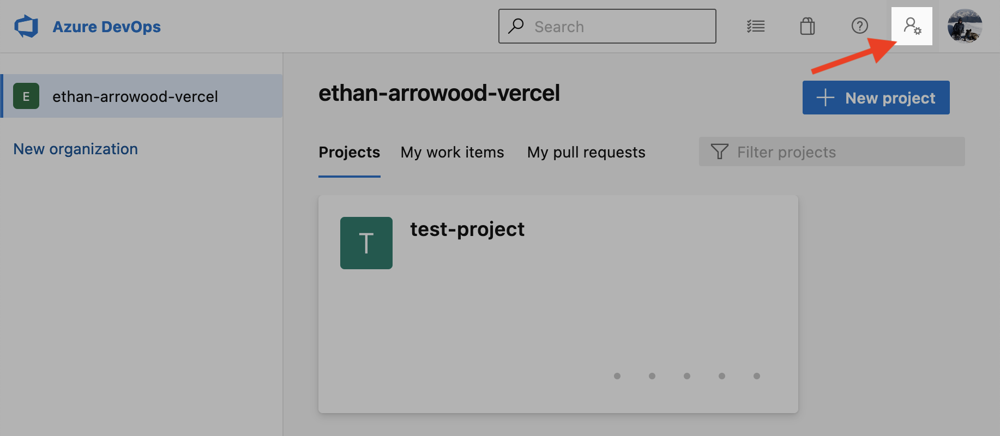

### 2. Click on the _Personal access tokens_ menu option

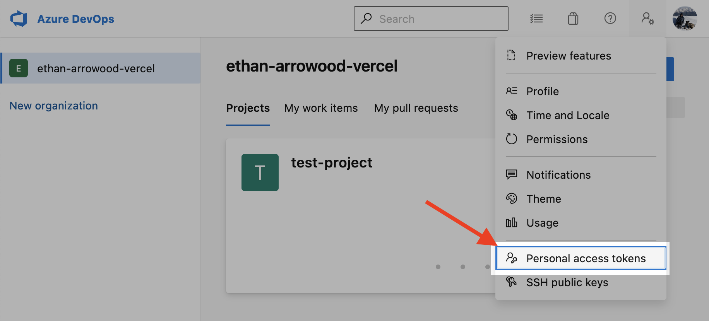

### 3. Click on _New Token_


### 4. After filling in the basic token information like name, organization, and expiration, click on _Custom Defined_ under Scopes

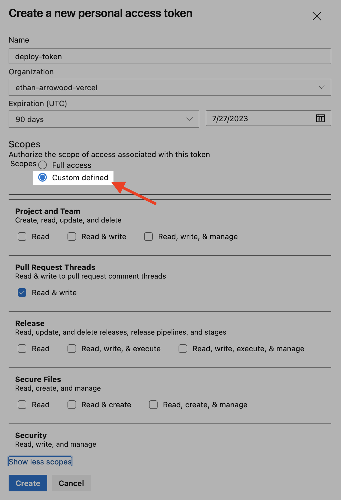

### 5. Then, _Show all scopes_ button at the bottom of the prompt

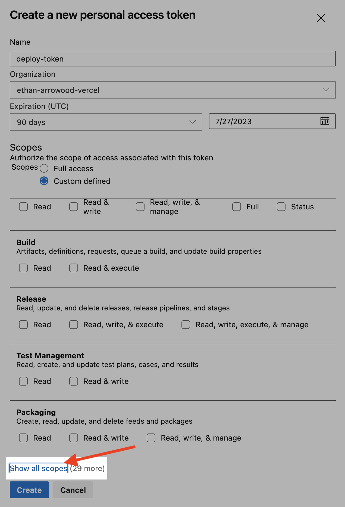

### 6. Then, within the scopes list, scroll until _Pull Request Threads_, and select the _Read & Write_ toggle.

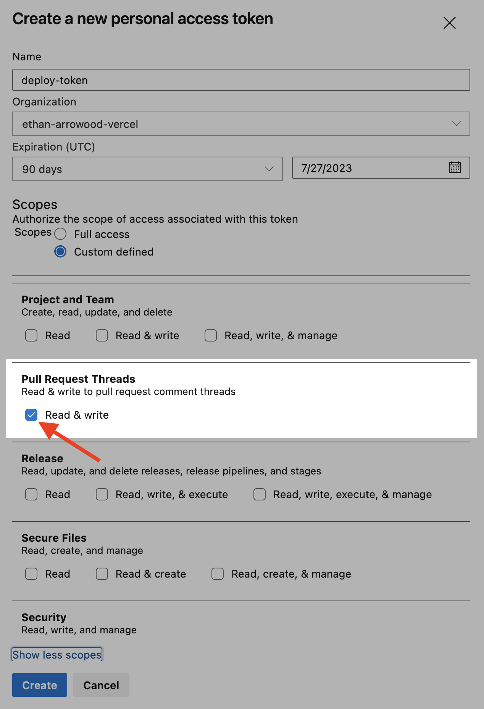

### 7. Click _Create_, and don't forget to copy the token as once you exit the prompt it will not be retrievable.

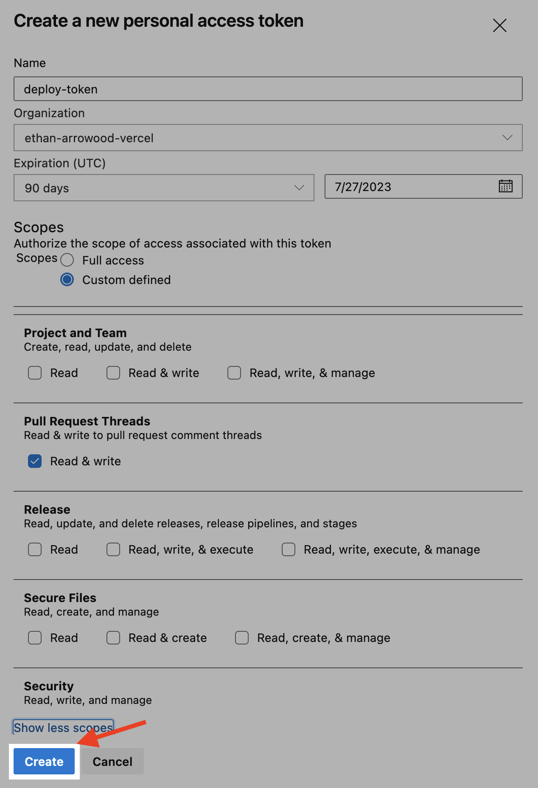

## Azure Build Policy Set Up

### 1. Navigate to the Azure DevOps organization Overview page. Click on **Project Settings** in the lower left corner.

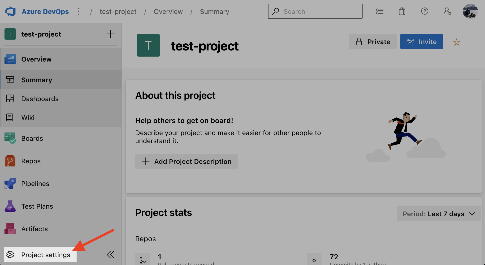

### 2. In the **Project Settings** list on the left, scroll down and click on the `Repositories` option

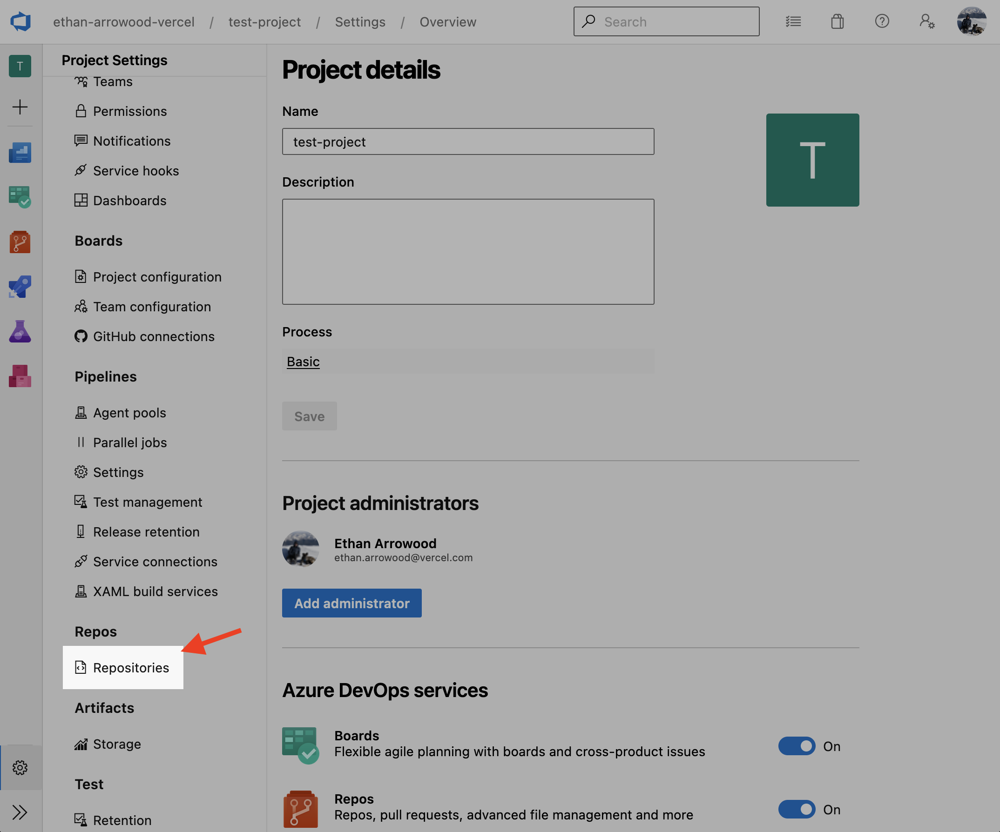

### 3. Select the repository

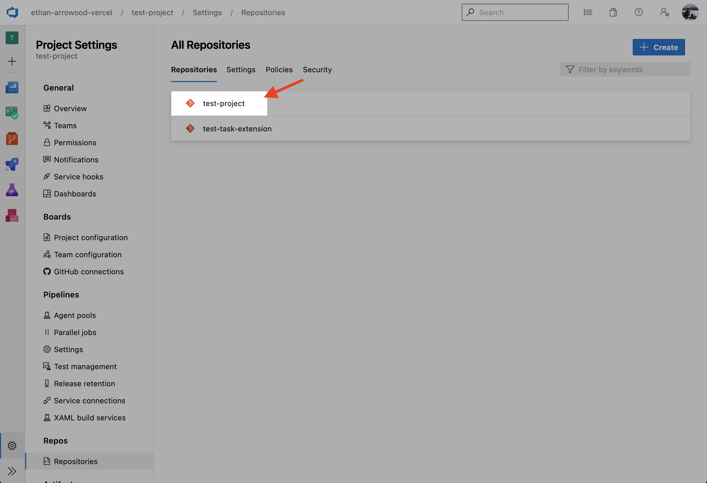

### 4. On the right side, select **Policies**

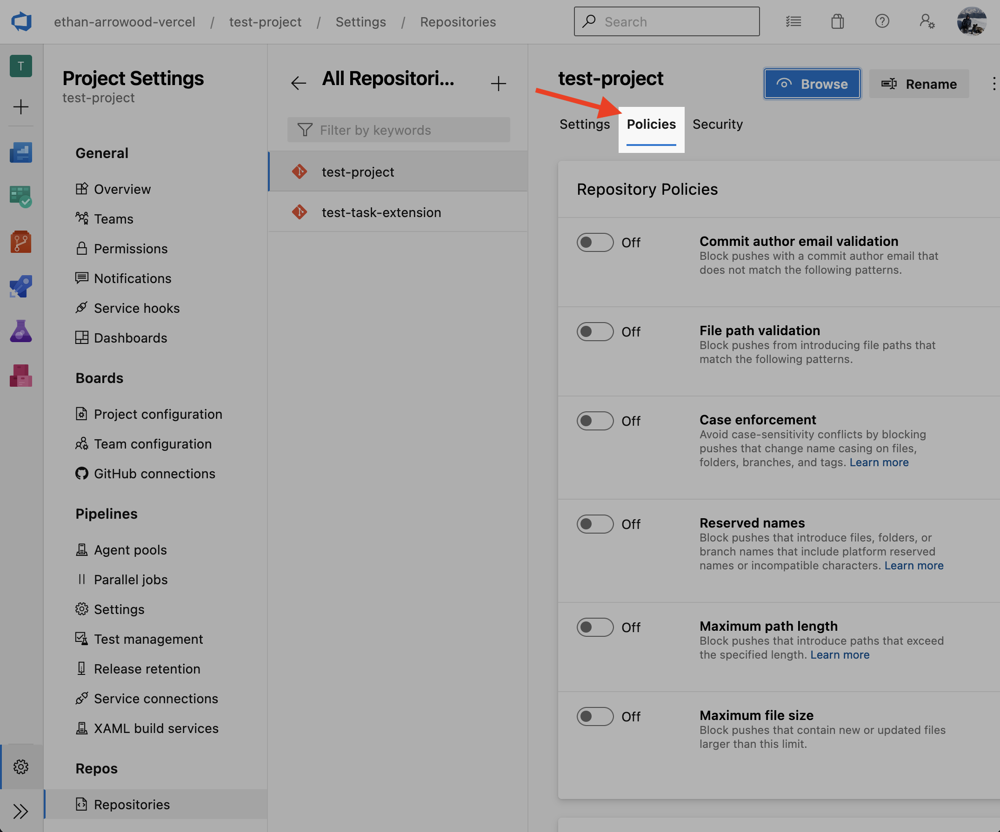

### 5. Scroll down to **Branch Policies**, and select the `main` branch

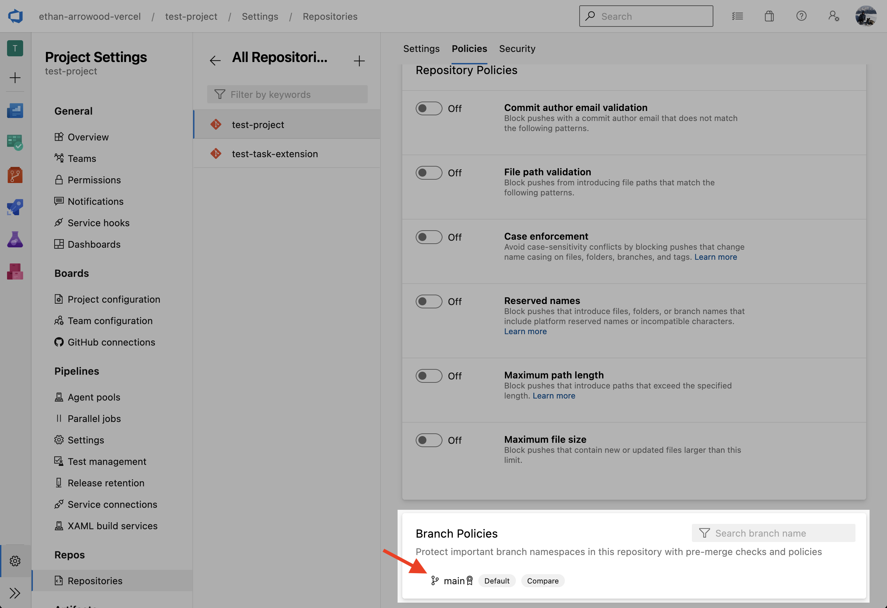

### 6. Scroll down to **Build Validation**, and click on the `+` button to create a new validation policy.

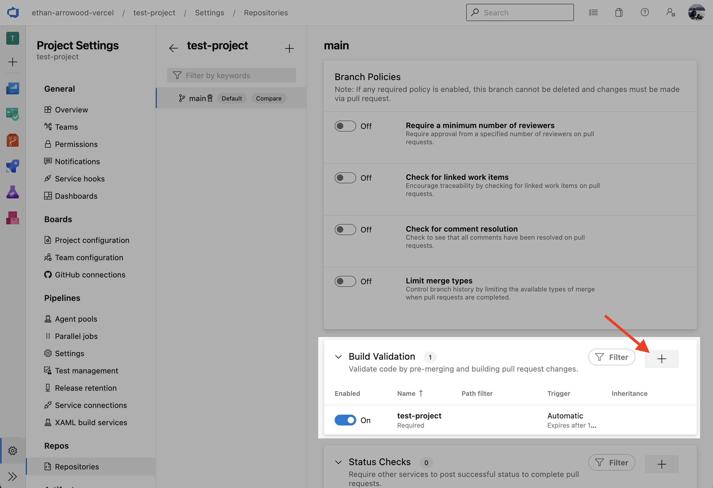

### 7. Select the pipeline previously created

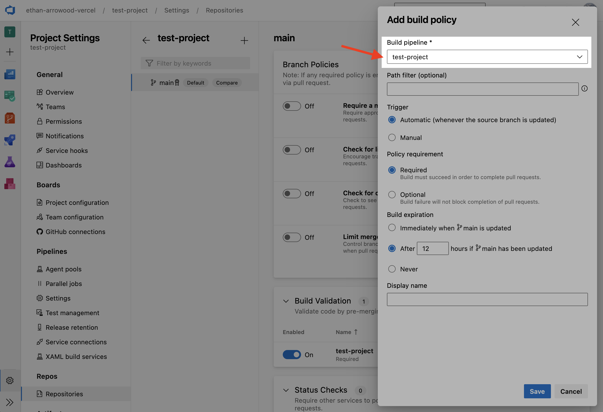

> Keep the policy marked as **Required** so that commits directly to `main` are prevented.

### 8. Finally, save the new validation policy

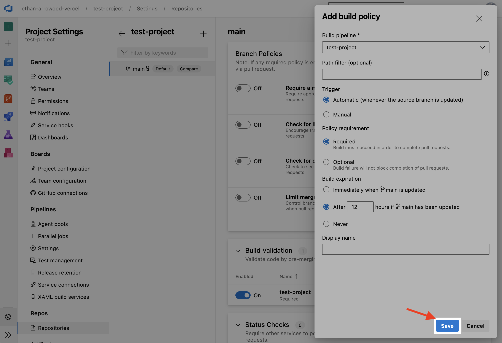

### 9. Create a pull request to the `main` branch, and if everything is set up correctly, the pipeline will run and comment back on the PR the deployment URL 🎉
