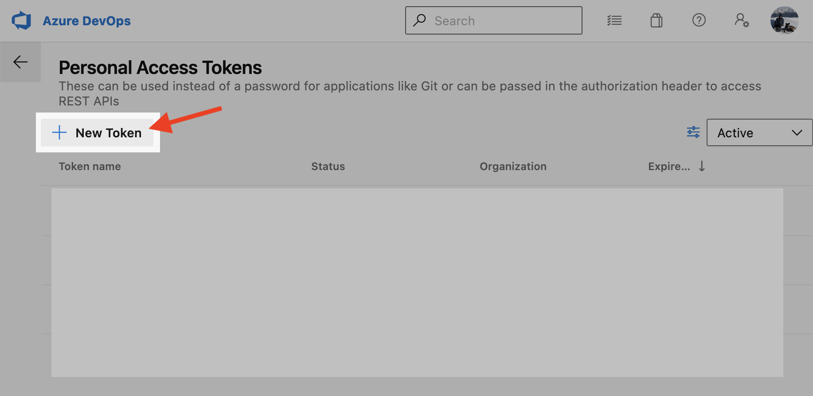

# Vercel Azure DevOps Extension

This extension contains the [Vercel Deployment Task] for automatically deploying your Azure DevOps project to Vercel. It contains other useful features like automatic Pull Request comments and a template pipeline for quick set up.

## Extension Set Up

1. Create a Vercel Project
1. Create a Vercel Personal Access Token with permissions to deploy the project created on step 1 (see the [Vercel PAT Set Up]() guide for more information)
1. Create a Azure DevOps Personal Access Token with permissions to Read/Write Pull Request threads (see the [Azure PAT set up](#azure-pat-set-up) guide for more information)
1. Navigate to the [Vercel Deployment Extension](https://marketplace.visualstudio.com/items?itemName=Vercel.vercel-deployment-extension) Visual Studio Marketplace page and add the extension to your organization.
   > Note: This step will not work until the extension is shared with the user or we make the extension public.
1. With the extension added, you are now ready to use it in your Azure Pipeline. It is referable using `- task: vercel-deployment-task@0`.
    > Note: The `@0` represents the Major version of the task that the pipeline should use. During prerelease, we will publish the extension under Major version `0`. The extension will use Major version `1` when it is released publicly.
1. If you need a step-by-step guide for setting up the extension in your Azure Pipeline, see the following [Manual Pipeline Set Up](#manual-pipeline-set-up) guide.

## Azure PAT Set Up

1. Go to [https://dev.azure.com](https://dev.azure.com) and click on the settings icon in the top right.
    
1. Click on the *Personal access tokens* menu option
    
1. Click on *New Token*
    
1. After filling in the basic token information like name, organization, and expiration, click on the *Show all scopes* button at the bottom of the prompt
    
1. Then, within the scopes list, scroll until _Pull Request Threads_, and select the _Read & Write_ toggle.
    
1. Click _Create_, and don't forget to copy the token as once you exit the prompt it will not be retrievable.
    
